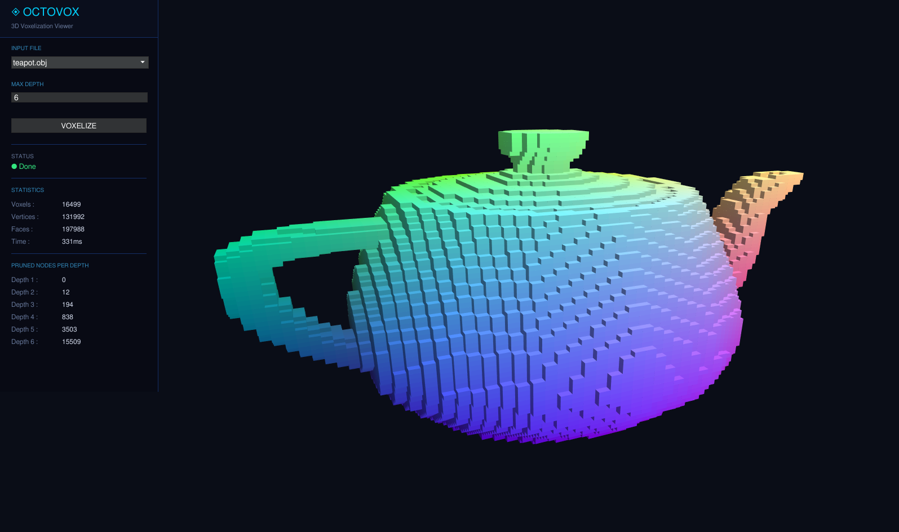

# OctoVox



OctoVox is a program for voxelizing 3D models in OBJ format using an octree data structure based on Divide and Conquer. It provides interactive visualization, max-depth configuration, voxelization statistics, and export of the voxelized result to a new OBJ file.

## Overview

Core features:
- OBJ file parsing (vertices and triangle faces).
- Model bounding box calculation.
- Octree construction up to a specified max-depth.
- Triangle-box intersection testing to determine active voxels.
- 3D voxel visualization using the G3N engine.
- Export voxelization results to an output OBJ file.
- Testing on normal cases and edge cases.

## Requirements

Minimum to run the program:
- OS: Windows 10/11 64-bit.
- Go: 1.26.1 or later.
- C/C++ toolchain for cgo (MinGW-w64/GCC available in PATH recommended).
- GPU/driver with OpenGL support (minimum OpenGL 3.x).
- At least 4 GB RAM (8 GB recommended for large models).
- At least 500 MB of free disk space.

Notes:
- When building via Makefile, audio dependency DLLs are automatically copied to the `bin` folder.

## How to Run

### Option 1 - Using Makefile (recommended)

1. Make sure you are in the project root.
2. Build the program:
```bash
make build
```
3. Run the program:
```bash
make run
```
4. Clean build binaries and DLLs:
```bash
make clean
```

### Option 2 - Directly via Go

```bash
cd src
go run .
```

## OBJ Format

The parser currently supports the following subset of the OBJ format:
- Vertex lines: `v x y z`
- Triangle face lines: `f i j k`

Important rules:
- Face indices must be positive integers starting from 1.
- Faces must be triangles (exactly 3 indices).
- Face index references must not exceed the total number of vertices.
- Empty lines, comments (`# ...`), and other tokens are ignored.

Valid example:
```obj
v 0 0 0
v 1 0 0
v 0 1 0
f 1 2 3
```

## Project Structure

```text
.
|- Makefile
|- go.mod
|- README.md
|- bin/
|- obj/
|- src/
|  |- main.go
|  |- packages/
|     |- intersect/
|     |- octree/
|     |- parser/
|     |- viewer/
|- docs/
   |- main.tex
   |- sections/
   |- public/
```

## Authors

| Name                          | Student ID |
|-------------------------------|------------|
| Muhammad Aufar Rizqi Kusuma   | 13524061   |
| Athilla Zaidan Zidna Fann     | 13524068   |

## How to Contribute

Contributions are welcome through the following workflow:

1. Fork the repository.
2. Create a new branch from `main`.
3. Make changes with clear commit messages.
4. Run local tests and build first.
5. Open a Pull Request containing:
   - a summary of the changes,
   - the reason for the changes,
   - impact on features or performance,
   - test evidence (if applicable).

Additional guidelines:
- Avoid committing unnecessary generated files (binaries, large outputs, etc.).
- Ensure your changes do not break the `make build` and `make run` workflow.
